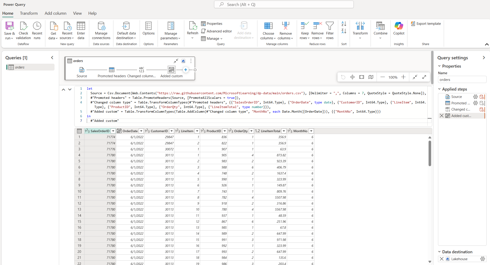

# Dataflows Gen2

## Actions
Dataflows Gen2 supports the following ETL actions:
- **Import** data from various sources
- **Clean** and filter raw inputs
- **Transform** using Power Query logic
- **Output** to a designated destination (e.g., Lakehouse, Warehouse)

## Uses
Dataflows Gen2 can be executed and integrated in multiple ways:
- Run manually via the **Run now** option
- Insert as an **action within a pipeline**
- Use as a **data source in Power BI** reports and models

## Concepts and Terminology
- Dataflows are created, managed, and modified using the **Power Query Editor**.
- The **Power Query Editor** is a graphical interface for designing and transforming data queries. Behind the scenes, it generates scripts written in the **M language** (also known as Power Query Formula Language), which define the steps for data extraction, transformation, and loading (ETL).
- A query authored in Power Query becomes a **dataflow** once saved and published.
- When working in Power Query through Microsoft Fabric, the experience is referred to as **Power Query Online**.
- Queries (data sources) added in Power Query will materialize as **tables** in your **Data Store** (e.g., Lakehouse or Warehouse).

## Notes
- Dataflows Gen2 supports **incremental refresh**, **parameterization**, and **schema evolution**, making it suitable for scalable, reusable onboarding workflows.
- All transformations are logged in the **Applied Steps** pane and can be reviewed or edited in the **Advanced Editor**.

## Creating a dataflow in a Fabric workspace

## Power Query Editor
