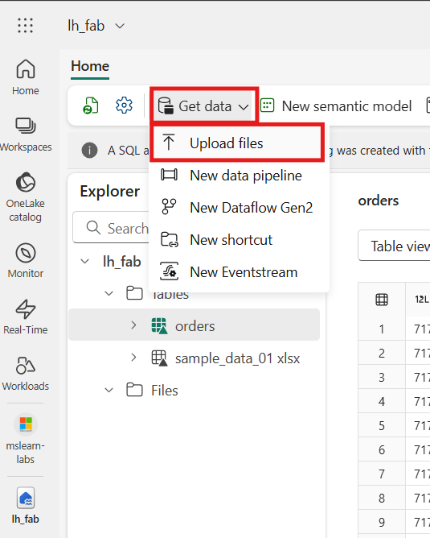
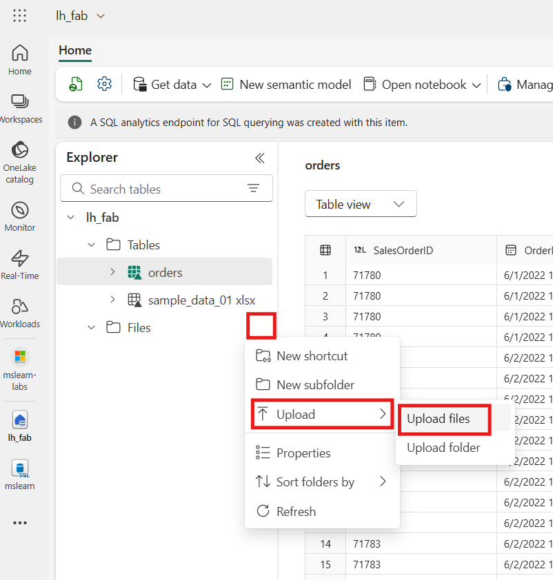
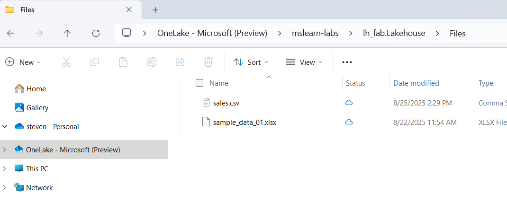
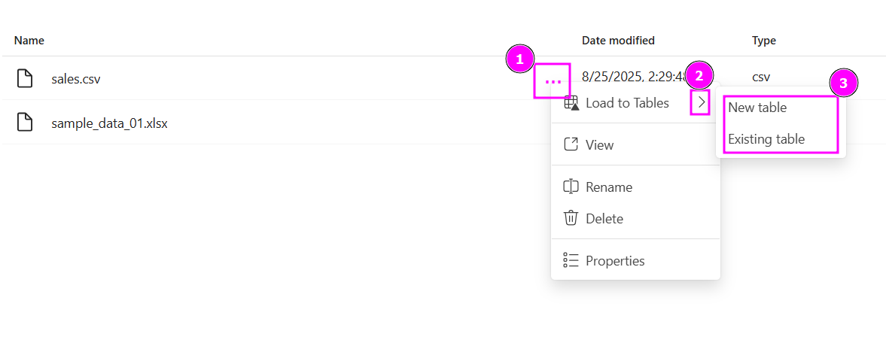
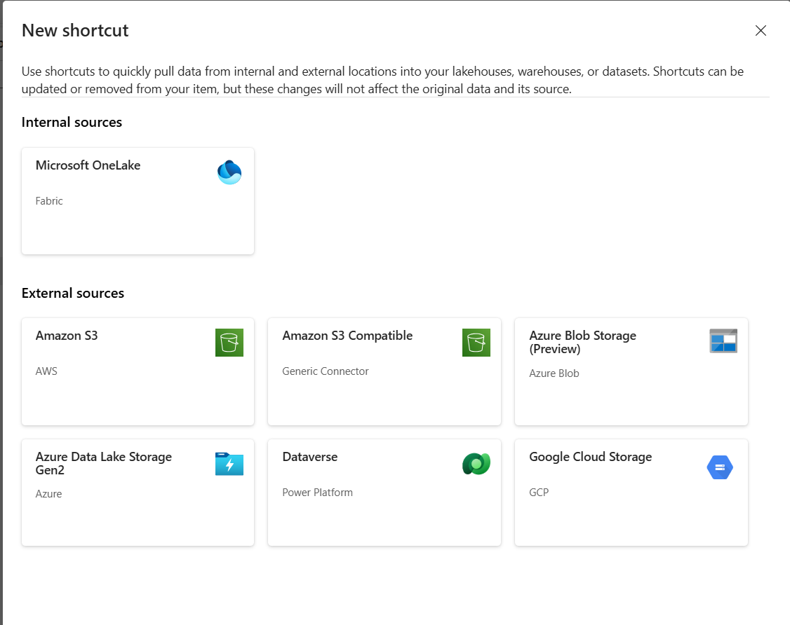

# Lakehouses

## Lakehouse Features
- A lakehouse presents as a database and is built on top of a data lake using Delta format tables. 
- Lakehouses combine the SQL-based analytical capabilities of a relational data warehouse and the flexibility and scalability of a data lake. 
- Lakehouses store all data formats and can be used with various analytics tools and programming languages. 
- As cloud-based solutions, lakehouses can scale automatically and provide high availability and disaster recovery.

## Benefits of a Lakehouse

- Lakehouses use Spark and SQL engines to process large-scale data and support machine learning or predictive modeling analytics.
- Lakehouse data is organized in a schema-on-read format, which means you define the schema as needed rather than having a predefined schema.
- Lakehouses support ACID (Atomicity, Consistency, Isolation, Durability) transactions through Delta Lake formatted tables for data consistency and integrity.
- Lakehouses are a single location for data engineers, data scientists, and data analysts to access and use data.
- A lakehouse is a great option if you want a scalable analytics solution that maintains data consistency. It's important to evaluate your specific requirements to determine which solution is the best fit.

## Ingest data into a Lakehouse
Ingesting data into your lakehouse is the first step in your ETL process. Use any of the following methods to bring data into your lakehouse.

- **Upload**: Upload local files.
- **Dataflows Gen2**: Import and transform data using Power Query.
- **Data Factory pipelines**: Use the Copy data activity.
- **Notebooks**: Use Apache Spark to ingest, transform, and load data.
- **Spark jobs**
    - Spark job definitions can also be used to submit batch/streaming jobs to Spark clusters. 
    - By uploading the binary files from the compilation output of different languages (for example, .jar from Java), you can apply different transformation logic to the data hosted on a lakehouse. 
    - Besides the binary file, you can further customize the behavior of the job by uploading more libraries and command line arguments.

## Shortcuts
Another way to access and use data in Fabric is to use shortcuts. Shortcuts enable you to integrate data into your lakehouse while keeping it stored in external storage.

Shortcuts are useful when you need to source data that's in a different storage account or even a different cloud provider. Within your lakehouse you can create shortcuts that point to different storage accounts and other Fabric items like data warehouses, KQL databases, and other lakehouses.

Source data permissions and credentials are all managed by OneLake. When accessing data through a shortcut to another OneLake location, the identity of the calling user will be utilized to authorize access to the data in the target path of the shortcut. The user must have permissions in the target location to read the data.

Shortcuts can be created in both lakehouses and KQL databases, and appear as a folder in the lake. This allows Spark, SQL, Real-Time intelligence and Analysis Services to all utilize shortcuts when querying data

## OneLake
OneLake is Fabric's centralized data storage architecture that enables collaboration by eliminating the need to move or copy data between systems. OneLake unifies your data across regions and clouds into a single logical lake without moving or duplicating data.

OneLake is built on Azure Data Lake Storage (ADLS) and supports various formats, including Delta, Parquet, CSV, and JSON. All compute engines in Fabric automatically store their data in OneLake, making it directly accessible without the need for movement or duplication. For tabular data, the analytical engines in Fabric write data in delta-parquet format and all engines interact with the format seamlessly.

Shortcuts are references to files or storage locations external to OneLake, allowing you to access existing cloud data without copying it. Shortcuts ensure data consistency and enable Fabric to stay in sync with the source.

## Discover data with OneLake catalog
The OneLake catalog in Microsoft Fabric helps users easily find and access various data sources within their organization. Users explore and connect to data sources, ensuring they have the right data for their needs. Users only see items shared with them. Here are some considerations when using OneLake catalog:

- Narrow results by workspaces or domains (if implemented).
- Explore default categories to quickly locate relevant data.
- Filter by keyword or item type.

## OneLake file explorer for Windows[🔗](https://www.microsoft.com/en-us/download/details.aspx?id=105222)
- The OneLake file explorer application seamlessly integrates Microsoft OneLake, the data lake for Microsoft Fabric, with the Windows File Explorer.

## Schema-on-Read

**What Is Schema-on-Read**
Schema-on-read means that the structure of the data (its schema) is not enforced when the data is stored, but rather defined at the time of access or query. This contrasts with schema-on-write, where the schema must be defined before data is ingested.

- Upload raw data first
- Define schema later based on business logic or downstream needs
- Evolve schema over time without re-ingesting data

**How It Works in Microsoft Fabric Lakehouse**
- **Files Folder**: Acts as a raw data zone. You can store any supported format here without needing to define a schema upfront.
- **Tables Folder**: When you load data from Files into Tables, Fabric converts it into Delta format and applies a schema.
- **SQL Analytics Endpoint**: Once data is in Tables, you can query it using T-SQL, which assumes a defined schema.

## Upload Files to a Lakehouse From Microsoft Fabric UI

### Upload Files to a Lakehouse using Microsoft OneLake file explorer for Windows [🔗](https://www.microsoft.com/en-us/download/details.aspx?id=105222)

---

## Load data from a `.csv` file in a Lakehouse into a table in the same Lakehouse

### Lakehouse File Ingestion using "Load to Tables" from the UI

| File Type | UI: Load to Tables | Requires Dataflow/Pipeline | Notes                      |
| --------- | ------------------ | -------------------------- | -------------------------- |
| `.csv`    | ✅ Yes             | Optional                   | Fastest path               |
| `.json`   | ❌ No              | ✅ Yes                     | Use newline-delimited JSON |
| `.tsv`    | ❌ No              | ✅ Yes                     | Treat as delimited text    |
| `.psv`    | ❌ No              | ✅ Yes                     | Requires schema mapping    |
| `.txt`    | ❌ No              | ✅ Yes                     | Depends on delimiter       |
| `.xlsx`   | ❌ No              | ✅ Yes                     | Use Excel connector        |

---

## Add a shortcut in lakehouse files

|Original Location|Name|Provider|Note|
|:--|:--|:--|:--|
|Internal|OneLake|Microsoft|Used to link to a different lakehouse|
|External|Amazon S3|AWS||
|External|Amazon S3 Compatible|Generic Connector||
|External|Azure Blob Storage (Preview)|Azure Blob||
|External|Azure Data Lake Storage Gen2|Azure||
|External|Dataverse|Power Platform||
|External|Google Cloud Storage|GCP||