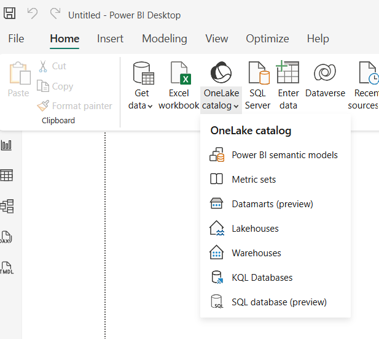
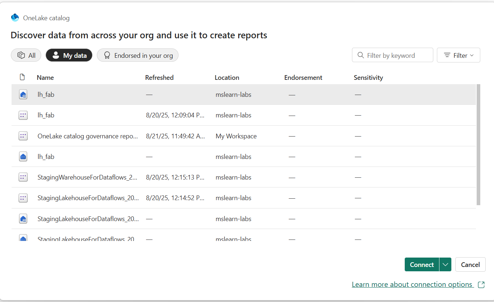
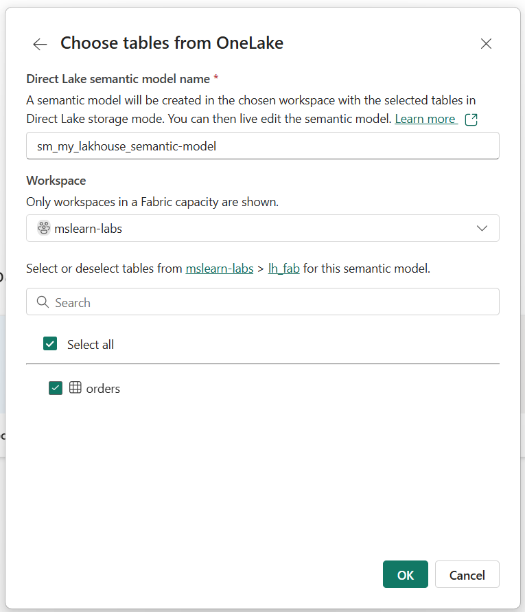
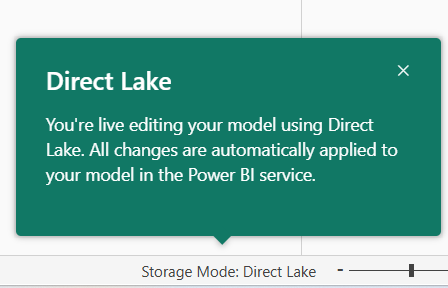

# Create a semantic model in Power BI Desktop and connect to Datalake

## (1) Connect to data source

## (2) Choose Lakehouse

## (3) Choose table(s) & provide a semantic model name

## (4) Results

---
