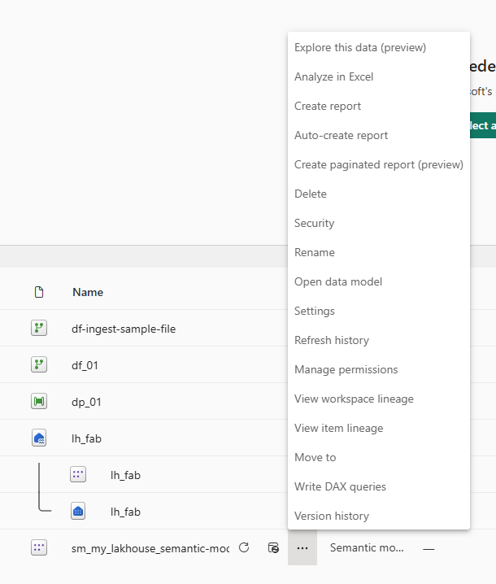
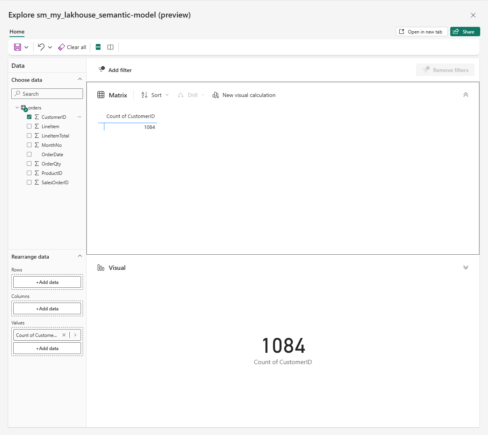
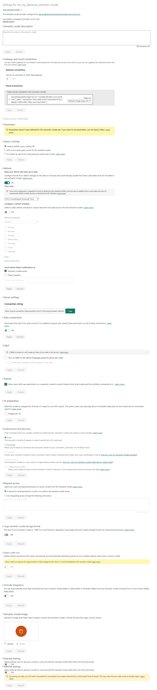
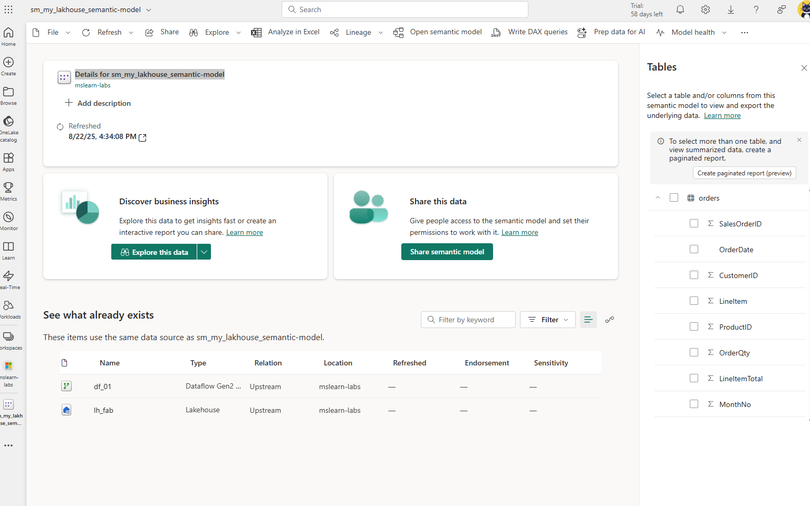
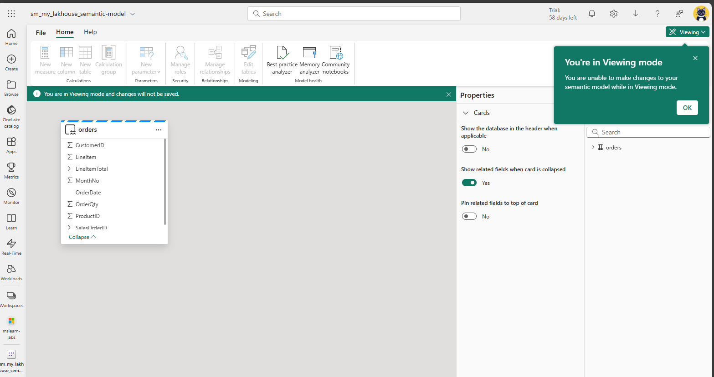

# Working with a semantic model in Fabric

[🔗 Manage objects in a workspace](#jump-01)
[🔗 Explore a semantic model](#jump-02)
[🔗 Semantic models settings](#jump-03)
[🔗 Semantic model detail](#jump-04)
[🔗 View Semantic Model](#jump-05)
[🔗 Edit a Semantic Model](#jump-06)

---
<a name="jump-01" /></a>

## Manage objects in a workspace
```/groups/{group_id}/list```


---
<a name="jump-02" /></a>

## Explore a semantic model
```/groups/{group_id}/datasets/{dataset_id}/explorations```



---
<a name="jump-03" /></a>

## Semantic models settings
```/groups/{group_id}/settings/datasets/{dataset_id}```



---
<a name="jump-04" /></a>

## Semantic model detail
```/groups/{group_id}/datasets/{dataset_id}/details```



---
<a name="jump-05" /></a>

## View Semantic Model
```/groups/{group_id}/modeling/{dataset_id}/modelView```



---
<a name="jump-06" /></a>

## Edit a Semantic Model
```/groups/{group_id}/modeling/{dataset_id}/modelView```

