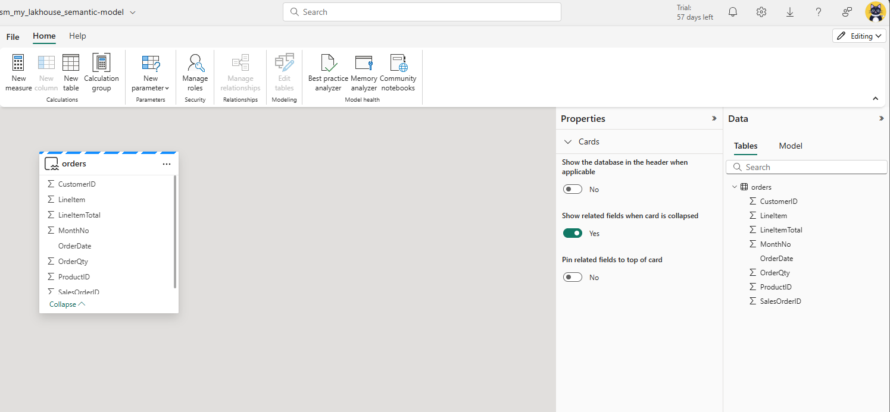

# Unable to add tables or manage relationships
---

---
❓
> I am editing a semantic model in Fabric. On the right side of the screen under 'data', I see only one table. How do i add more tables to that menu?

🤖 Copilot:
>To add more tables to the ‘Data’ pane in your semantic model in Microsoft Fabric, you’ll need to bring additional tables into the model from your Lakehouse or Warehouse. Here’s how to do it:

### Add Tables to Your Semantic Model in Fabric
### Use “Edit tables” in the Ribbon
- In the top ribbon, click “Edit tables” (you’ll find it between “Manage relationships” and “Best practice analyzer”).
- A ialog will open showing all available tables from your connected Lakehouse or Warehouse.

### Check the boxes next to the tables you want to include.

- Click “Apply” or “Add” to bring them into your semantic model.
- Once added, they’ll appear in the ‘Tables’ tab under the ‘Data’ pane on the left.

---
❓
> Edit Tables appears in the ribbon, but it's greyed out.

🤖 Copilot:
>If “Edit tables” is greyed out in your semantic model editor, it usually means one of the following is true:

### Why “Edit Tables” Might Be Disabled
1. No Lakehouse or Warehouse Connected
- The semantic model must be linked to a Lakehouse or Warehouse.
- If it’s not connected, Fabric doesn’t know where to pull additional tables from.

2. Model Is Based on a Single Table Import
- If the model was created from a single table (e.g. via “Create semantic model” from a specific table), it may not have a broader data source context.
- In this case, you’ll need to recreate the model from the full Lakehouse or Warehouse.

3. Permissions or Dataset Lock
- You might not have edit permissions on the underlying dataset.
- Or the dataset is locked due to a workspace setting or deployment pipeline.

### How to Fix It
Option A: Recreate the Semantic Model from Full Lakehouse
- Go to your Lakehouse in Fabric.
- Click the “New semantic model” button.
- Select multiple tables to include.
- Save and open the model—“Edit tables” should now be active.

Option B: Check Dataset Permissions
- Go to the dataset in your workspace.
- Ensure you have Build and Edit permissions.
- If needed, ask your workspace admin to grant access.

---
❓
> How to I check this option: No Lakehouse or Warehouse Connected The semantic model must be linked to a Lakehouse or Warehouse.

🤖 Copilot:
> Based on your current semantic model view, here's how you can verify whether it's connected to a Lakehouse or Warehouse—and what to do if it's not:

### How to Check If Your Semantic Model Is Connected
Open the semantic model in Fabric (which you’ve already done).

In the top ribbon, **look for the “Edit tables” button**.
If it’s greyed out, that’s a strong signal the model isn’t linked to a Lakehouse or Warehouse.

**Click the “Manage relationships” button**.
If you see only one table and no relationships, it likely means the model was created from a single table import—not from a full Lakehouse or Warehouse.

Go to the Workspace where the semantic model lives.
**Look for a Lakehouse** or Warehouse asset with a similar name or creation timestamp.
If none exists, the model is probably standalone.

### What to Do If It’s Not Connected
**Option A**: Recreate the Semantic Model from a Lakehouse
- Navigate to your Lakehouse in Fabric.
- Click “New semantic model”.
- Select multiple tables to include.
- Save and open the model—“Edit tables” should now be active.

**Option B**: Recreate from a Warehouse
- Go to your Warehouse in Fabric.
- Click “New semantic model”.
- Select the tables you want.
- Save and open—same result.

---
[OneLake integration for semantic models](https://learn.microsoft.com/en-us/fabric/enterprise/powerbi/onelake-integration-overview)