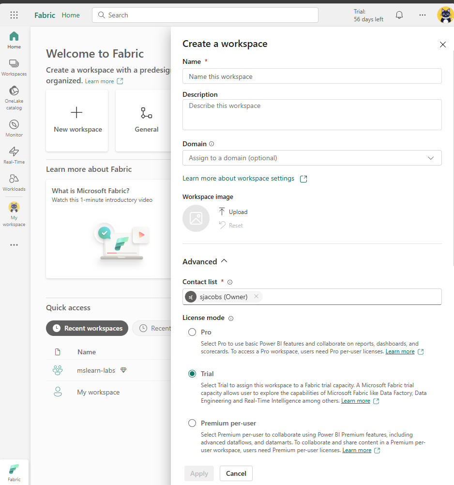

[Fabric-Home](https://app.fabric.microsoft.com/home?experience=fabric-developer)

[Create a workspace in Power BI](https://learn.microsoft.com/en-us/power-bi/collaborate-share/service-create-the-new-workspaces)

- Workspace Settings:
    -⚙️General
        - Choose an image (optional)
        - Provide a name
        - Provide a description (optional)
        - Notifications
        - Workspace contacts
    - 💎License             
        - Pro
    - Azure connections
        - Azure Data Lake Gen2 Storage
    - System storage
    - Git integration
    - OneLake
    - Workspace identity
    - Outbound networking
    - Encription
    - Power BI
        - General
            - Secure update
            - Template apps
        - Data model settings
            - Data connections
            - Embed Codes
    - Delegated settings
        - OneLake settings
        - Copilot and Azure OpenAI Service​
        

---
**Create workspaces**
Workspaces are collaborative environments where you can create and manage items like lakehouses, warehouses, and reports. All data is stored in OneLake and accessed through workspaces. Workspaces also support data lineage view, providing a visual view of data flow and dependencies to enhance transparency and decision-making.

In Workspace settings, you can configure:

- License type to use Fabric features.
- OneDrive access for the workspace.
- Azure Data Lake Gen2 Storage connection.
- Git integration for version control.
- Spark workload settings for performance optimization.

You can manage workspace access through four roles: admin, contributor, member, and viewer. These roles apply to all items in a workspace and should be reserved for collaboration. For more granular access control, use item-level permissions based on business needs.        
