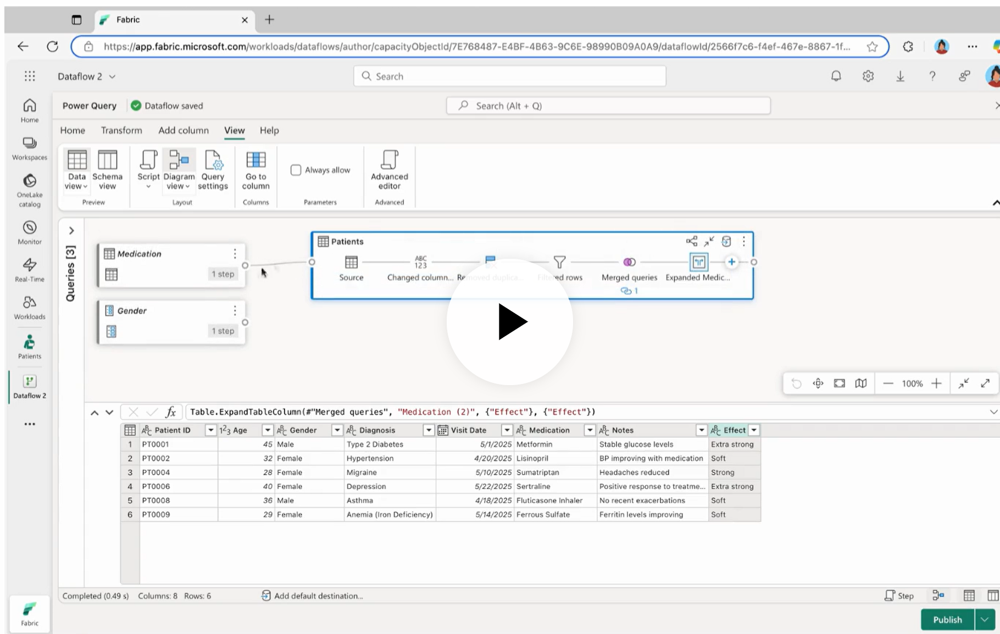

# Week 1 Reflection

## 💡 Highlights
- Discovered how Fabric consolidates services under one SaaS model
- Found parallels between Power BI workspaces and Fabric workspaces

## ⚠️ Challenges
- Understanding domain scoping vs. workspace boundaries
- Navigating Fabric’s evolving UI

## 🚀 Next Steps
- Explore ingestion patterns for Week 2
- Document workspace governance configuration

In this module, you will learn how to use Dataflows Gen2

## Unit 1
Dataflows Gen2
- import
- clean
- transform
- use in pipelines
- use as datasource in power bi

## Unit 2
---
**🧠 My Question to Copilot**  
> *I have used Azure Data Factory, both piplelines and dataflows.  What is the equivalent of these technologies in Fabric?

**🤖 Copilot’s Response**  
In Microsoft Fabric, the equivalent of Azure Data Factory’s pipelines is referred to as data pipelines. These data pipelines in Fabric work seamlessly with Lakehouse, Data Warehouse, and other Fabric services. For data transformation, Azure Data Factory’s dataflows are equivalent to Dataflow Gen2 in Fabric, which provides a simpler experience for building transformations and offers more capabilities than the previous versions.

Additionally, the concepts of linked services and datasets in Azure Data Factory have been simplified in Fabric to just connections, which are easier to set up and manage. This streamlining allows users to focus on their data integration tasks without the complexity of previous configurations.

---

**🔗 Offsite Resource**  
[Differences between Azure Data Factory and Fabric Data Factory](https://learn.microsoft.com/en-us/fabric/data-factory/compare-fabric-data-factory-and-azure-data-factory)  

**📄 Key Extract / Comparison Table**  

| Azure Data Factory                              | Data Factory in Fabric                  | What's Different |
|-------------------------------------------------|------------------------------------------|------------------|
| Pipeline                                        | Data pipeline                            | **Better integration:** Works seamlessly with Lakehouse, Data Warehouse, and other Fabric services out of the box. |
| Mapping data flow                               | Dataflow Gen2                            | **Easier to use:** Simpler experience for building transformations; more mapping dataflow features are being added over time. |
| Activities                                      | Activities                               | **More activities coming:** Includes new ones like Office 365 Outlook activity not in ADF. See Activity overview for details. |
| Dataset                                         | Connections only                         | **Simpler approach:** No complex dataset configurations; use connections to link to data sources and start working. |
| Linked Service                                  | Connections                              | **More intuitive:** Same concept as linked services but easier to set up and manage. |
| Triggers                                        | Schedule and file event triggers         | **Built-in scheduling:** Fabric’s scheduler and Reflex events run pipelines automatically; file event triggers work natively. |
| Publish                                         | Save and Run                             | **No publishing step:** Just Save to store or Run to save and execute immediately. |
| Autoresolve and Azure Integration runtime       | Not needed                               | **Simplified architecture:** No integration runtimes to manage; Fabric handles compute. |
| Self-hosted integration runtimes                | On-premises Data Gateway                 | **Same on-premises access:** Use the familiar On-premises Data Gateway. |
| Azure-SSIS integration runtimes                 | To be determined                         | **Future capability:** SSIS integration design in progress for Fabric. |
| Managed virtual networks and private endpoints  | To be determined                         | **Future capability:** Integration for managed VNETs and private endpoints in progress. |
| Expression language                             | Expression language                      | **Same expressions:** Existing syntax transfers directly. |
| Authentication types                            | Authentication kinds                     | **More options:** All ADF authentication methods work in Fabric, plus new types added. |
| CI/CD                                           | CI/CD                                    | **Coming soon:** Full CI/CD capabilities planned for Fabric Data Factory. |
| ARM export/import                               | Save as                                  | **Quick duplication:** Use "Save as" to duplicate pipelines for dev or testing. |
| Monitoring                                      | Monitoring hub + Run history             | **Advanced monitoring:** Modern hub with cross-workspace insights and better drill-down. |

## Unit 3

# Where can I access my Gen2 Dataflows?
- Data Factory
- Power BI workspace
- Directly in the lakehouse

Data flows are created, managed, and modified in the Power Query editor.  
A query that has been created in the Power Query editor is a dataflow.

A few things you can do in Power Query that are not really dataflow activities (these are not data transformations)
- Manage Connections
- Set the default data destination
- create and manage parameters

Tip
- If a table exists only for reference (say, a lookup table) and will never change, You can disable the load of a query, in case you only need the one-time import.
---
**🧠 My Question to Copilot**  
> *I have a dataflow gen2 with several data sources.  One of those data sources only needs to be loaded once.  It's a reference table that is used to map values, for lookup purposes only.  The other data sources are dynamic, and should be refreshed whenever the whole dataflow is refreshed.  How can I do that? 

**🤖 Copilot’s Response**  
In Dataflows Gen2, you can manage the loading behavior of your data sources by utilizing the query settings. For your reference table, which only needs to be loaded once, you can disable the load of that specific query. To do this, navigate to the Queries pane, select the reference table query, and find the option to disable the load. This means that when you refresh the dataflow, the reference table will not be reloaded, and it will only be loaded once. This approach allows the other dynamic data sources to refresh as needed without affecting the reference table, optimizing performance by preventing unnecessary loads of static data.

---
**🧠 My Question to Copilot**  
> *Tell me more about enabling staging on tables to improve performance during data transformations. 

**🤖 Copilot’s Response**  
In Microsoft Fabric, enabling staging on tables can significantly enhance performance during data transformations. Staging allows intermediate data to be stored temporarily, which can reduce the load on the primary data store and optimize the transformation processes. By using staging, you can perform complex transformations more efficiently, as it minimizes the need for repeated reads and writes to the main data storage, thus speeding up the overall data processing workflow. This approach is particularly beneficial when dealing with large datasets or complex transformation logic, as it allows for better resource management and improved throughput during data operations.

> Link: [Offload data staging and ETL processing to Data Lake Storage and Data Factory](https://learn.microsoft.com/en-us/azure/synapse-analytics/migration-guides/teradata/7-beyond-data-warehouse-migration#offload-data-staging-and-etl-processing-to-data-lake-storage-and-data-factory)

Digital transformation has created a key challenge for enterprises by generating a torrent of new data for capture and analysis. A good example is transaction data created by opening online transactional processing (OLTP) systems to service access from mobile devices. Much of this data finds its way into data warehouses, and OLTP systems are the main source. With customers now driving the transaction rate rather than employees, the volume of data in data warehouse staging tables has been growing rapidly.

With the rapid influx of data into the enterprise, along with new sources of data like Internet of Things (IoT), companies must find ways to scale up data integration ETL processing. One method is to offload ingestion, data cleansing, transformation, and integration to a data lake and process data at scale there, as part of a data warehouse modernization program.

Once you've migrated your data warehouse to Azure Synapse, Microsoft can modernize your ETL processing by ingesting and staging data in Data Lake Storage. You can then clean, transform, and integrate your data at scale using Data Factory before loading it into Azure Synapse in parallel using PolyBase.

For ELT strategies, consider offloading ELT processing to Data Lake Storage to easily scale as your data volume or frequency grows.

---
**🧠 My Question to Copilot**  
> *Please tell me some differences between Gen2 dataflows in Fabric and what I am used to doing in Power Query through Power BI in the past.  I am new to Gen2 dataflows and have been using Power BI for many years. 

**🤖 Copilot’s Response**  
Dataflows Gen2 in Microsoft Fabric present several differences compared to the Power Query experience you are familiar with in Power BI. One of the main enhancements is the integration of Power Query Online within Dataflows Gen2, which allows for a more visual representation of transformations. Users can connect to a wide variety of data sources, including cloud and on-premises databases, Excel files, and Fabric lakehouses, facilitating seamless data ingestion.

In terms of transformations, Dataflows Gen2 supports familiar operations such as filtering, sorting, merging, and pivoting. However, the interface is designed to be more intuitive, featuring a Diagram View that visually displays how data sources are connected and transformed. This visual aid can help you better understand the flow of data and the applied transformations.

Another significant difference is how queries are managed. In Dataflows Gen2, queries are referred to as tables once loaded into the data store, and users can easily duplicate or reference these queries. This functionality streamlines data modeling processes, allowing for efficient creation of structures like star schemas without extensive manual configuration. Additionally, Dataflows Gen2 provide a low-to-no-code solution, making it more accessible for users who may not have coding expertise, while still retaining the powerful transformation capabilities you are accustomed to in Power BI.

Lastly, Dataflows Gen2 also include performance optimization features, such as enabling staging on tables, which can greatly enhance performance during data transformations. This capability allows for better resource management and improved throughput, especially when working with large datasets or complex transformation logic, making your data processing workflows more efficient.
---
 