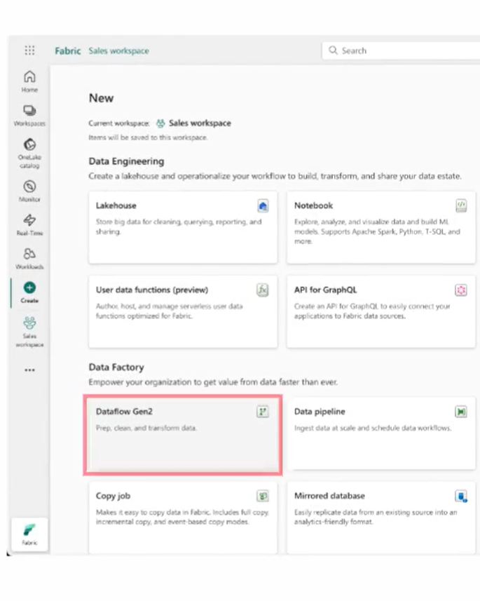
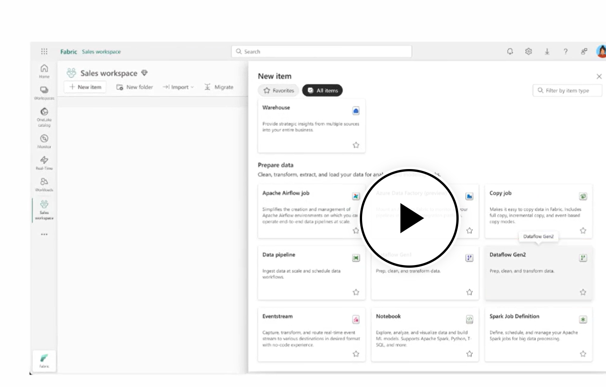
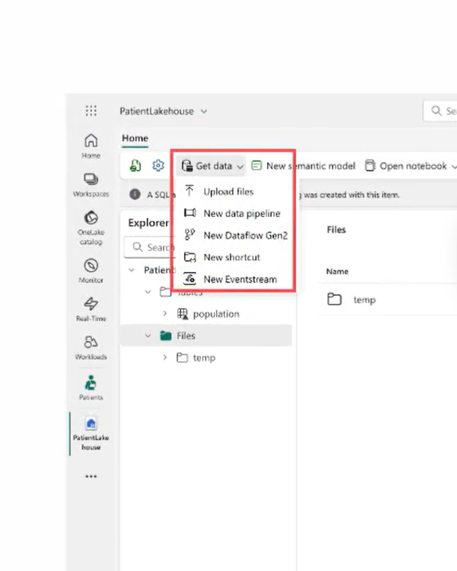

[Differences between Azure Data Factory and Fabric Data Factory](#jump-01)
[Where can I access my Gen2 Dataflows?](#jump-02)
[Staging on tables to improve performance during data transformations](#jump-03)
[Gen2 Dataflows vs Power Query Gen1 Dataflows](#jump-04)
[Fact tables Dimensional tables and Star Schema](#jump-05)
[Transactional Tables](#jump-06)
[Normalization and denormalization](#jump-07)
["Normal Form" Concepts ](#jump-08)
[Avoid Recomputing Views Every Time ](#jump-09)
[Why SQL Views Fall Short for Lineage  ](#jump-10)
[Unit 4 - Integrate Dataflows Gen2 and Pipelines in Microsoft Fabric ](#jump-13)


# Week 1 Reflection

In this module, you will learn how to use Dataflows Gen2

### Unit 1

#### Dataflows Gen2
- import
- clean
- transform
- use in pipelines
- use as datasource in power bi


## Unit 2
---
<a name="jump-01" /></a>

## Differences between Azure Data Factory and Fabric Data Factory
> I have used Azure Data Factory, both piplelines and dataflows.  What is the equivalent of these technologies in Fabric?


**🤖 Copilot’s Response**  
> In Microsoft Fabric, the equivalent of Azure Data Factory’s pipelines is referred to as data pipelines. These data pipelines in Fabric work seamlessly with Lakehouse, Data Warehouse, and other Fabric services. For data transformation, Azure Data Factory’s dataflows are equivalent to Dataflow Gen2 in Fabric, which provides a simpler experience for building transformations and offers more capabilities than the previous versions.
<br>Additionally, the concepts of linked services and datasets in Azure Data Factory have been simplified in Fabric to just connections, which are easier to set up and manage. This streamlining allows users to focus on their data integration tasks without the complexity of previous configurations.


🔗 [Differences between Azure Data Factory and Fabric Data Factory](https://learn.microsoft.com/en-us/fabric/data-factory/compare-fabric-data-factory-and-azure-data-factory)  


| Azure Data Factory                              | Data Factory in Fabric                  | What's Different |
|-------------------------------------------------|------------------------------------------|------------------|
| Pipeline                                        | Data pipeline                            | **Better integration:** Works seamlessly with Lakehouse, Data Warehouse, and other Fabric services out of the box. |
| Mapping data flow                               | Dataflow Gen2                            | **Easier to use:** Simpler experience for building transformations; more mapping dataflow features are being added over time. |
| Activities                                      | Activities                               | **More activities coming:** Includes new ones like Office 365 Outlook activity not in ADF. See Activity overview for details. |
| Dataset                                         | Connections only                         | **Simpler approach:** No complex dataset configurations; use connections to link to data sources and start working. |
| Linked Service                                  | Connections                              | **More intuitive:** Same concept as linked services but easier to set up and manage. |
| Triggers                                        | Schedule and file event triggers         | **Built-in scheduling:** Fabric’s scheduler and Reflex events run pipelines automatically; file event triggers work natively. |
| Publish                                         | Save and Run                             | **No publishing step:** Just Save to store or Run to save and execute immediately. |
| Autoresolve and Azure Integration runtime       | Not needed                               | **Simplified architecture:** No integration runtimes to manage; Fabric handles compute. |
| Self-hosted integration runtimes                | On-premises Data Gateway                 | **Same on-premises access:** Use the familiar On-premises Data Gateway. |
| Azure-SSIS integration runtimes                 | To be determined                         | **Future capability:** SSIS integration design in progress for Fabric. |
| Managed virtual networks and private endpoints  | To be determined                         | **Future capability:** Integration for managed VNETs and private endpoints in progress. |
| Expression language                             | Expression language                      | **Same expressions:** Existing syntax transfers directly. |
| Authentication types                            | Authentication kinds                     | **More options:** All ADF authentication methods work in Fabric, plus new types added. |
| CI/CD                                           | CI/CD                                    | **Coming soon:** Full CI/CD capabilities planned for Fabric Data Factory. |
| ARM export/import                               | Save as                                  | **Quick duplication:** Use "Save as" to duplicate pipelines for dev or testing. |
| Monitoring                                      | Monitoring hub + Run history             | **Advanced monitoring:** Modern hub with cross-workspace insights and better drill-down. |


## Unit 3

💡Data flows are created, managed, and modified in the Power Query editor.  
💡A query that has been created in the Power Query editor is a **dataflow**.
💡When working in Power Query through Fabric, this can also be referred to as **Power Query Online**

💡A few things you can do in Power Query that are not really dataflow activities (these are not data transformations)
- Manage Connections
- Set the default data destination
- create and manage parameters

💡Queries (data sources) that are added in Power Query will become Tables in your Data Store.

<a name="jump-02" /></a>

#### Where can I access my Gen2 Dataflows?
- Data Factory workload
> In Microsoft Fabric, a Data Factory workload refers to the environment where you build and manage data integration processes—especially using Dataflows Gen2. Think of it as your workspace for ingesting, transforming, and loading data across various sources into Fabric destinations like lakehouses, warehouses, or SQL databases.


- Power BI workspace

- Directly in the lakehouse



---
<a name="jump-03" /></a>

# Staging on tables to improve performance during data transformations  
>❓  I have a dataflow gen2 with several data sources.  One of those data sources only needs to be loaded once.  It's a reference table that is used to map values, for lookup purposes only.  The other data sources are dynamic, and should be refreshed whenever the whole dataflow is refreshed.  How can I do that? 

>🤖 
In Dataflows Gen2, you can manage the loading behavior of your data sources by utilizing the query settings. For your reference table, which only needs to be loaded once, you can disable the load of that specific query. To do this, navigate to the Queries pane, select the reference table query, and find the option to disable the load. This means that when you refresh the dataflow, the reference table will not be reloaded, and it will only be loaded once. This approach allows the other dynamic data sources to refresh as needed without affecting the reference table, optimizing performance by preventing unnecessary loads of static data.

In Microsoft Fabric, enabling staging on tables can significantly enhance performance during data transformations. Staging allows intermediate data to be stored temporarily, which can reduce the load on the primary data store and optimize the transformation processes. By using staging, you can perform complex transformations more efficiently, as it minimizes the need for repeated reads and writes to the main data storage, thus speeding up the overall data processing workflow. This approach is particularly beneficial when dealing with large datasets or complex transformation logic, as it allows for better resource management and improved throughput during data operations.


🔗 [Offload data staging and ETL processing to Data Lake Storage and Data Factory](https://learn.microsoft.com/en-us/azure/synapse-analytics/migration-guides/teradata/7-beyond-data-warehouse-migration#offload-data-staging-and-etl-processing-to-data-lake-storage-and-data-factory)

Digital transformation has created a key challenge for enterprises by generating a torrent of new data for capture and analysis. A good example is transaction data created by opening online transactional processing (OLTP) systems to service access from mobile devices. Much of this data finds its way into data warehouses, and OLTP systems are the main source. With customers now driving the transaction rate rather than employees, the volume of data in data warehouse staging tables has been growing rapidly.

With the rapid influx of data into the enterprise, along with new sources of data like Internet of Things (IoT), companies must find ways to scale up data integration ETL processing. One method is to offload ingestion, data cleansing, transformation, and integration to a data lake and process data at scale there, as part of a data warehouse modernization program.

Once you've migrated your data warehouse to Azure Synapse, Microsoft can modernize your ETL processing by ingesting and staging data in Data Lake Storage. You can then clean, transform, and integrate your data at scale using Data Factory before loading it into Azure Synapse in parallel using PolyBase.

For ELT strategies, consider offloading ELT processing to Data Lake Storage to easily scale as your data volume or frequency grows.

---
<a name="jump-04" /></a>

# Gen2 Dataflows vs Power Query Gen1 Dataflows

>❓ Tell me some differences between Gen2 dataflows and what I am used to doing in Power Query through Power BI in the past.

>🤖  
Dataflows Gen2 in Microsoft Fabric present several differences compared to the Power Query experience you are familiar with in Power BI. One of the main enhancements is the integration of Power Query Online within Dataflows Gen2, which allows for a more visual representation of transformations. Users can connect to a wide variety of data sources, including cloud and on-premises databases, Excel files, and Fabric lakehouses, facilitating seamless data ingestion.

In terms of transformations, Dataflows Gen2 supports familiar operations such as filtering, sorting, merging, and pivoting. However, the interface is designed to be more intuitive, featuring a Diagram View that visually displays how data sources are connected and transformed. This visual aid can help you better understand the flow of data and the applied transformations.

Another significant difference is how queries are managed. In Dataflows Gen2, queries are referred to as tables once loaded into the data store, and users can easily duplicate or reference these queries. This functionality streamlines data modeling processes, allowing for efficient creation of structures like star schemas without extensive manual configuration. Additionally, Dataflows Gen2 provide a low-to-no-code solution, making it more accessible for users who may not have coding expertise, while still retaining the powerful transformation capabilities you are accustomed to in Power BI.

Lastly, Dataflows Gen2 also include performance optimization features, such as enabling staging on tables which can greatly enhance performance during data transformations. This capability allows for better resource management and improved throughput, especially when working with large datasets or complex transformation logic, making your data processing workflows more efficient.

---
<a name="jump-05" /></a>

# Fact tables Dimensional tables and Star Schema
>❓ Please tell me more about fact tables Dimensional tables and Star Schema


>🤖 Fact and dimension tables are the backbone of star schema and snowflake schema designs in data warehousing, and they’re central to how Microsoft Fabric’s Data Warehouse and Lakehouse models organize analytical data.

### Fact Tables — The “What Happened”
Fact tables store measurable, quantitative data — the actual events or transactions you want to analyze.

**Characteristics**
- Contain metrics like sales amount, quantity, revenue, clicks, etc.
- Include foreign keys pointing to related dimension tables
- Often very large — millions or billions of rows
- Support aggregations (SUM, AVG, COUNT) in BI tools

**Example**
| DateKey	| ProductKey	| StoreKey	| SalesAmount |	UnitsSold|
|------------|------------|------------|------------|------------|
|20250801|101|501|1200.00|3|

This row says: *“On August 1st, product 101 was sold at store 501 for $1200, 3 units.”*

### Dimension Tables — The “Context”
Dimension tables store descriptive attributes — the who, what, where, when, and how of each fact.

**Characteristics**
- Contain textual or categorical data (names, categories, locations)
- Are typically wide (many columns) but shallow (fewer rows)
- Help slice and filter fact data in reports
- Often used in hierarchies (e.g., Year → Quarter → Month)

**Example: Product Dimension**
|ProductKey|ProductName|Category|Brand|
|----|----|----|----|
|101|Fabric Hoodie|Apparel|Contoso|

This lets you say: *“Show me total sales by brand” or “Compare hoodie sales across categories.”*

**How They Work Together**
In a star schema, the fact table sits at the center, surrounded by dimension tables:


```
           +-------------+
           | Date Dim    |
           +-------------+
                 |
+-------------+  |  +-------------+
| Product Dim |--+--| Store Dim   |
+-------------+     +-------------+
        \             /
         \           /
     +------------------+
     |   Fact Table     |
     +------------------+
```

In Fabric’s Data Warehouse and Lakehouse:

- You define fact tables in SQL or Delta format to store metrics
- You build dimension tables to support semantic models in Power BI
- You can use Direct Lake mode to query them directly from Power BI with blazing speed

Here’s a full star schema design for a Fabric-based sales dashboard.

## 🌟 Star Schema: Retail Sales Analytics

### Fact Table: SalesFact
Stores the measurable events — each row is a transaction.

| Column Name    | Description                       | Type     |
| :------------- | :-------------------------------- | :------- |
| SalesID        | Unique identifier for the sale    | INT (PK) |
| DateKey        | Foreign key to Date dimension     | INT (FK) |
| ProductKey     | Foreign key to Product dimension  | INT (FK) |
| StoreKey       | Foreign key to Store dimension    | INT (FK) |
| CustomerKey    | Foreign key to Customer dimension | INT (FK) |
| UnitsSold      | Quantity sold                     | INT      |
| SalesAmount    | Total revenue                     | DECIMAL  |
| DiscountAmount | Discount applied                  | DECIMAL  |

### Dimension Tables

#### ProductDim
Describes each product.

| Column Name | Description       |
| :---------- | :---------------- |
| ProductKey  | Unique product ID |
| ProductName | Name of product   |
| Category    | Product category  |
| Brand       | Brand name        |
| UnitPrice   | Standard price    |


#### StoreDim
Describes each store location.

| Column Name | Description       |
| :---------- | :---------------- |
| StoreKey    | Unique store ID   |
| StoreName   | Name of store     |
| Region      | Geographic region |
| ManagerName | Store manager     |

#### CustomerDim
Describes each customer.

| Column Name | Description        |
| :---------- | :----------------- |
| CustomerKey | Unique customer ID |
| FullName    | Customer name      |
| Gender      | Gender             |
| AgeGroup    | Age bracket        |
| LoyaltyTier | Loyalty program    |

#### DateDim
Describes the time of sale.

| Column Name | Description     |
| :---------- | :-------------- |
| DateKey     | YYYYMMDD format |
| Date        | Full date       |
| Month       | Month name      |
| Quarter     | Q1–Q4           |
| Year        | Calendar year   |


#### Why This Works in Fabric
- You can store these tables in Lakehouse or Warehouse using Delta or SQL formats.
- Use Direct Lake mode in Power BI to query them instantly without import delays.
- Dimension tables support slicing and filtering in reports (e.g., “Sales by Region” or “Top Products by Brand”).
- Fact tables support aggregations (e.g., total revenue, average discount).

#### Optional Enhancements
- Add a TimeDim table if you want to analyze by hour/minute.
- Include a PromotionDim if discounts are tied to campaigns.
- Use surrogate keys for better performance and flexibility.


---
<a name="jump-06" /></a>

# Transactional Tables
> I’m familiar, in financial databases, with the concept of transaction tables.  How is that similar?


>🤖   
Great question, Steven — your familiarity with transaction tables in financial databases gives you a solid foundation for understanding fact tables in star schemas. They’re conceptually similar but serve slightly different purposes depending on the context.

Similarities Between Transaction Tables and Fact Tables
| Aspect       | Transaction Table (Finance)                     | Fact Table (Star Schema)                          |
| :----------- | :---------------------------------------------- | :------------------------------------------------ |
| Granularity  | Each row = one financial event (e.g., payment)  | Each row = one business event (e.g., sale)        |
| Time-stamped | Includes transaction date/time                  | Includes date/time via foreign key to DateDim     |
| Measures     | Contains amounts, fees, balances                | Contains metrics like revenue, quantity, discount |
| Foreign Keys | Links to accounts, customers, products          | Links to dimensions like Product, Store, Customer |
| Immutable    | Typically append-only for audit trail           | Also append-only to preserve historical accuracy  |
| Used for BI  | Supports financial reporting and reconciliation | Supports analytical reporting and dashboards      |

**Key Differences**
- Normalization vs. Denormalization:
    - Transaction tables are often normalized for integrity and storage efficiency.
    - Fact tables are denormalized to optimize query performance in analytical workloads.

- Purpose
    - Transaction tables are operational — used for day-to-day processing and compliance.
    - Fact tables are analytical — designed for slicing, dicing, and aggregating data.
- Design Philosophy:
    - Financial systems prioritize accuracy and auditability.
    - Star schemas prioritize speed and usability in BI tools like Power BI.

**Example Mapping**
Let’s say you have a financial transaction table like this:


| TransactionID | AccountID | Date       | Amount  | Type       |
| :------------ | :-------- | :--------- | :------ | :--------- |
| 1001          | A123      | 2025-08-01 | 500.00  | Deposit    |
| 1002          | A123      | 2025-08-02 | -200.00 | Withdrawal |

In a star schema, this might translate to:

**Transaction Fact Table**

- DateKey
- AccountKey
- TransactionTypeKey
- Amount
- TransactionCount

**Dimension Tables**

AccountDim 
- AccountID
- HolderName
- Type

DateDim 
- DateKey
- Month
- Year

TransactionTypeDim
- Deposit
- Withdrawal
- Transfer


If you're thinking about modeling financial data in Fabric for analytics, you could absolutely treat your transaction tables as fact tables — just enrich them with dimension keys and structure them for performance.

---
<a name="jump-07" /></a>


# Normalization and denormalization

>❓ Tell me more about normalization and denormalization

> 🤖 
Understanding normalization and denormalization is key to designing efficient databases and analytical models. These concepts shape how data is structured, stored, and queried — especially in systems like Microsoft Fabric, where both transactional and analytical workloads coexist.

### Normalization — “Organize to Minimize Redundancy”
Normalization is the process of structuring a relational database to reduce data duplication and improve data integrity.

🔹 Goals:
- Eliminate redundant data
- Ensure consistency across updates
- Break data into logical, related tables

🔹 Example:
Instead of storing customer names in every order record:

Orders Table

| OrderID | CustomerID | Date       |
| :------ | :--------- | :--------- |
| 1001    | C001       | 2025-08-01 |

Customers Table

| CustomerID | FullName      | Email            |
| :--------- | :------------ | :--------------- |
| C001       | Steven Jacobs | steven@email.com |

Now, if Steven updates his email, it only changes in one place.


### Denormalization — “Flatten for Speed”
Denormalization is the process of intentionally adding redundancy to improve query performance, especially in analytical systems.

🔹 Goals:
- Reduce joins during queries
- Speed up reads for dashboards and reports
- Simplify schema for BI tools

🔹 Example:
Instead of joining multiple tables, you might store customer name directly in the orders table:

Orders Table (Denormalized)

| OrderID | CustomerName  | Email            | Date       |
| :------ | :------------ | :--------------- | :--------- |
| 1001    | Steven Jacobs | steven@email.com | 2025-08-01 |

This makes reporting faster, but if Steven changes his name, you now have to update it in every row.

### When to Use Each
| Use Case                               | Normalization                     | Denormalization                 |
| :------------------------------------- | :-------------------------------- | :------------------------------ |
| OLTP (Online Transaction Processing)   | ✅ Yes — integrity and efficiency | ❌ Avoid — slows writes         |
| OLAP (Online Analytical Processing)    | ❌ Avoid — too many joins         | ✅ Yes — faster reads           |
| Microsoft Fabric Lakehouse / Warehouse | ❌ Avoid deep normalization       | ✅ Favor star/snowflake schemas |


---
<a name="jump-08" /></a>

# "Normal Form" Concepts 
**1NF – First Normal Form**
Rule: Every column should contain atomic values — meaning indivisible, single pieces of data.
- ❌ Bad: PhoneNumbers = "123-4567, 987-6543" (a list in one field)
- ✅ Good: Each phone number gets its own row or column
Why it matters: It prevents ambiguity and makes querying easier. You don’t want to parse lists inside cells.

**2NF – Second Normal Form**
Rule: No partial dependencies on a composite key (a key made of multiple columns).
- Applies only if your table has a composite primary key.
- A column should depend on the whole key, not just part of it.
Example: If your key is (StudentID, CourseID), then CourseName should not be in the same table — it depends only on CourseID, not the full key.
Why it matters: Keeps related data in the right place and avoids duplication across rows.

**3NF – Third Normal Form**
Rule: No transitive dependencies — non-key columns should depend only on the primary key.
- ❌ Bad: StudentID → AdvisorID → AdvisorName
- ✅ Good: Split into two tables: one for students, one for advisors
Why it matters: Prevents update anomalies. If an advisor’s name changes, you don’t want to update it in 50 places.

**Why “Normal Form”?**
- In logic and mathematics, a "normal form" is a way to simplify or standardize expressions so they follow a consistent structure.
- Codd applied this idea to databases: each "normal form" represents a level of refinement in how data is structured.
- The goal was to make databases more predictable, efficient, and resistant to update anomalies.


**Why are they numbered 1NF, 2NF, 3NF?**
The numbering reflects a progressive hierarchy:

| Normal Form | What It Fixes                          | Builds On          |
| :---------- | :----------------------------------- | :---------------- |
| 1NF         | Atomic values                         | no repeating groups |
| 2NF         | No partial dependencies on composite keys | 1NF               |
| 3NF         | No transitive dependencies             | 2NF               |

- Each form inherits the rules of the previous one and adds stricter constraints.


---
<a name="jump-09" /></a>

# Avoid Recomputing Views Every Time 
> I often struggle with the issue that a sql view could be very slow to generate each time requested from the server.  And, because the data was only refreshed once per hour, it seemed wasteful to calculate a view every time a report was ran.  So, every time the data was refreshed, we would save the view as a temporary table and use that as the report dataset.  How can I do this better using fabric?

**🤖 Copilot’s Response**  
That’s a classic pain point — and Fabric gives you some powerful tools to solve it more elegantly and scalably. You’re already thinking like a performance-minded engineer: caching the view as a table is smart, but in Fabric you can take it further with 
- Lakehouse shortcuts
- Warehouse materialization
- Direct Lake mode in Power BI.

### Strategic Comparison
| Approach                        | Pros                | Cons                                          | Uses Fabric? |
| :------------------------------ | :------------------ | :-------------------------------------------- | ------------ |
| ❌ SQL View                      | Simple, reusable    | Slow if complex joins, recalculated each time | ❌           |
| ❌ Temp Table                    | Faster reads        | Manual refresh logic, storage overhead        | ❌           |
| ❌ Materialized View (Warehouse) | Auto-refresh, fast  | Limited to Warehouse                          | ✅           |
| ✅ Lakehouse Table via Notebook  | Flexible, scalable  | Requires Spark or pipeline setup              | ✅           |
| 🏆 Dataflow Gen2                | Low-code, scheduled | Less control over logic granularity           | ✅           |
| 🏆 Direct Lake Mode             | Instant visuals     | Requires Lakehouse-backed model               | ✅           |


### Goal: Avoid Recomputing Views Every Time
- Instead of recalculating a complex SQL view on every report run, you want to:
    - Precompute once per refresh
    - Store the result efficiently
    - Serve it fast to Power BI or other consumers


### Better Options in Microsoft Fabric
#### 1. Materialized Views (Warehouse)
Fabric Warehouses support materialized views, which:

    - Cache the result of a SQL query
    - Automatically refresh on a schedule or manually
    - Are queryable like regular tables

Example:

```sql

CREATE MATERIALIZED VIEW mv_SalesReport AS
SELECT ...
FROM FactSales
JOIN DimCustomer ...
```
✅ You can then query mv_SalesReport directly in Power BI — no recomputation needed.


**Is MATERIALIZED a sql command?**  

**🤖 Copilot’s Response**  
Great question, Steven — and yes, MATERIALIZED VIEW is a SQL construct, but it’s not part of the original ANSI SQL standard. It’s supported by many modern database engines (like PostgreSQL, Oracle, and Microsoft Fabric Warehouse) as an extension to standard SQL.

🧱 What Is MATERIALIZED VIEW?
A materialized view is like a snapshot of a query result that’s stored as a physical table. Unlike a regular view (which runs the query every time), a materialized view:

- Stores the result of the query
- Can be refreshed manually or automatically
- Is indexed and optimized for fast reads

🧠 Syntax Example (Fabric Warehouse Style)
```sql
CREATE MATERIALIZED VIEW mv_SalesSummary AS
SELECT 
    c.CustomerName,
    SUM(s.SaleAmount) AS TotalSales,
    COUNT(*) AS Transactions
FROM FactSales s
JOIN DimCustomer c ON s.CustomerID = c.CustomerID
GROUP BY c.CustomerName;
```
This creates a precomputed table-like object that can be queried instantly:

```sql
SELECT * FROM mv_SalesSummary;
```

🔄 Refreshing the View
Depending on the platform, you can:

- Schedule automatic refreshes
- Use REFRESH MATERIALIZED VIEW manually
- Trigger refreshes via pipelines or orchestration tools

In Microsoft Fabric, you’d typically refresh it using:

- Data pipelines
- Notebook jobs
- Or SQL commands if supported in the Warehouse

🧩 When to Use It
| Use Case                        | Materialized View                             |
| :------------------------------ | :-------------------------------------------- |
| Complex joins or aggregations   | ✅ Excellent                                  |
| Frequently accessed report data | ✅ Ideal                                      |
| Real-time updates needed        | ❌ Not ideal (use regular views or streaming) |

<br><br>


#### 2. Lakehouse Tables via Notebooks or Pipelines
If you’re working in the Lakehouse, you can:

- Use a Spark notebook or Dataflow Gen2 pipeline to run your SQL view logic
- Save the result as a Delta table in the Lakehouse

✅ This gives you:

- Fast reads via Direct Lake mode
- Versioning and time travel if needed
- Reuse across multiple reports

Example notebook logic:

```python

df = spark.sql("""
SELECT ...
FROM FactSales
JOIN DimCustomer ...
""")
df.write.format("delta").mode("overwrite").save("/Tables/SalesReport")
```
<br><br>

### 3. Dataflow Gen2 with Scheduled Refresh
You can recreate your view logic in a Dataflow Gen2, then:

- Output the result to a Lakehouse table
- Schedule it to refresh hourly (or faster)
- Use that table as your Power BI source

✅ This is low-code and integrates beautifully with Fabric’s refresh orchestration.

<br><br>

### 4. Direct Lake Mode in Power BI
Once your precomputed table is in the Lakehouse:

- Connect Power BI using Direct Lake
- No import, no refresh delay
- Lightning-fast performance

✅ This eliminates the need for temporary tables or manual caching — Fabric handles it.


Direct Lake mode in Microsoft Fabric is essentially a best‑of‑both‑worlds storage mode for Power BI semantic models that live in a Fabric workspace.

🚀 What it is
Direct Lake is a storage mode option for tables in a Power BI semantic model that reads data directly from Delta tables in OneLake — Fabric’s unified data store — and feeds it into the VertiPaq engine for blazing‑fast queries.

Think of it as:
- Import‑like performance (because VertiPaq is still doing the heavy lifting in memory)
- DirectQuery‑like freshness (because it doesn’t require full data reloads)

🔑 How it works
- Data stays in OneLake — no full copy into the PBIX file or local machine.
- When a query runs, only the needed data pages are pulled into memory.
- Refresh is metadata‑only (“framing”), which just updates pointers to the latest Delta files — often in seconds, not minutes or hours.
- All heavy data prep (joins, transformations, aggregations) happens upstream in Fabric using Spark, T‑SQL, Dataflows, Pipelines, etc.

📊 Why it matters
| Feature       | Direct Lake              | Import                     | DirectQuery                   |
| :------------ | :----------------------- | :------------------------- | :---------------------------- |
| Query engine  | VertiPaq                 | VertiPaq                   | Source system                 |
| Data location | OneLake Delta tables     | In‑memory cache            | Source system                 |
| Refresh cost  | Low (metadata only)      | High (full data copy)      | None                          |
| Performance   | High                     | High                       | Variable                      |
| Data volume   | Can exceed memory limits | Limited by capacity memory | Limited by source performance |


🛠 Power BI Desktop experience
- You live‑edit the semantic model directly in the Fabric workspace — no “Publish” step.
- Version history is automatic; Git integration is supported for pro dev workflows.
- PBIP (Power BI Project) format lets you store model/report metadata locally for source control.
- Reports connect live to the semantic model in OneLake.

💡 Fabric‑focused take
For your gold layer in a medallion architecture, Direct Lake is a sweet spot:
- Keeps your Lakehouse/Warehouse as the single source of truth.
- Avoids Import mode’s memory ceiling.
- Still delivers sub‑second visuals for well‑modeled datasets.
- Plays nicely with your documentation‑driven approach — you can clearly map lineage from Lakehouse Delta tables to semantic model objects.


---
<a name="jump-10" /></a>


## Why SQL Views Fall Short for Lineage  
> One concern I have using views is that it’s difficult to visualize the lineage of datasets when there are multiple joins and especially hard to track complex data transformations.  I have always used views and stored procedures before, but I think I’m going to need to learn dataflow gen2 to improve visibility and clarity on where my data comes from.

**🤖 Copilot’s Response**  
> That’s a sharp observation, Steven — and you’re absolutely right to pivot toward Dataflow Gen2 for better transparency and governance. SQL views and stored procedures are powerful, but they’re often black boxes when it comes to lineage, transformation tracking, and collaboration. Fabric’s Dataflow Gen2 is built to solve exactly that.

🔍 Why SQL Views Fall Short for Lineage
- Opaque logic: Joins and transformations are buried in SQL scripts
- No visual trace: Hard to see how fields are derived or where they originate
- Limited metadata: No built-in documentation or change tracking
- Hard to debug: Especially when multiple views are layered or nested

🌐 Why Dataflow Gen2 Is a Game-Changer
Dataflow Gen2 is Fabric’s low-code ETL tool that gives you visual clarity, modular design, and built-in lineage tracking.

🧠 Key Benefits:
Visual transformation steps: Each join, filter, and column derivation is a node in a flow

Automatic lineage mapping: You can trace every field back to its source

Reusable logic: You can parameterize, reuse, and version transformations

Integrated refresh scheduling: No need for manual temp tables or stored procs

Lakehouse-native: Outputs are stored as Delta tables, perfect for Direct Lake mode

🛠️ What You Can Build
Imagine replacing a complex SQL view like this:

```sql
SELECT 
    c.CustomerName,
    SUM(s.SaleAmount) AS TotalSales,
    COUNT(*) AS Transactions
FROM FactSales s
JOIN DimCustomer c ON s.CustomerID = c.CustomerID
GROUP BY c.CustomerName;
```

With a Dataflow Gen2 pipeline that:
- Ingests FactSales and DimCustomer
- Joins them visually
- Aggregates sales per customer
- Outputs to a Lakehouse table SalesSummary

Now you can:
- See each step
- Track lineage from source to output
- Refresh it hourly
- Use it directly in Power BI with blazing speed

🧩 Bonus: Integration with OneLake + Semantic Models
- Dataflow Gen2 outputs are stored in OneLake, Fabric’s unified data lake
- You can build semantic models on top of these outputs
- Lineage flows from raw data → transformation → semantic layer → report

🚀 Next Steps for You
Given your strengths in scripting and automation, you’ll love how Dataflow Gen2 lets you:
- Parameterize inputs
- Reuse transformations across modules
- Document logic for recruiters or collaborators


---
<a name="jump-11" /></a>


# Gen2 Workflow Documentation
> After I build a complex gen2 workflow, what’s a best practice for documentation in GitHub, or is there a better place to document within the fabric ecosystem?

**🤖 Copilot’s Response**  
> That’s a strategic question, Steven — and it shows your instinct for building not just performant workflows, but discoverable, maintainable systems. You’re absolutely right to think beyond just GitHub and consider how documentation fits into the Fabric ecosystem itself.

Let’s break down the best practices across both worlds:

🧾 In GitHub: Portfolio-Driven Documentation
Since you’re already optimizing for recruiter visibility and reproducibility, GitHub remains essential. Here’s how to document your Gen2 workflows effectively:

📁 Recommended Structure
```

/Dataflows/
├── CustomerSalesSummary/
│   ├── README.md
│   ├── lineage.md
│   ├── transformations.sql
│   └── refresh_schedule.md
```
📌 Key Files
- README.md: Overview of the dataflow’s purpose, inputs, outputs, and business logic
- lineage.md: Diagram or table showing source tables → transformations → output
- transformations.sql: If you used SQL steps, include snippets or pseudocode
- refresh_schedule.md: Document how and when the dataflow refreshes

🧠 Bonus Tips
- Use badges or tags like #Fabric, #DataflowGen2, #DP-700 for discoverability
- Link to your Fabric workspace or Power BI report (if public or demo)
- Include screenshots of the visual flow or lineage graph

🧠 Inside Fabric: Native Documentation & Lineage
- Fabric gives you built-in lineage and metadata tracking, which you can leverage for internal clarity and collaboration.

🧩 Best Practices in Fabric
- Name your dataflow clearly: Use semantic naming like df_CustomerSalesSummary
- Add descriptions to each step: You can annotate transformations inside Gen2
- Use tags and labels: Fabric supports tagging datasets and flows for searchability
- Leverage the Lineage View: Fabric auto-generates lineage graphs showing source → transformation → destination → report

📊 Semantic Model Integration
- If your dataflow feeds a semantic model:
    - Document measures and calculated columns inside the model
    - Use description fields for each table and column
    - This metadata flows into Power BI and helps report consumers understand the logic

🧠 Hybrid Strategy: GitHub + Fabric
| Purpose                | GitHub        | Fabric       |
| :--------------------- | :------------ | :----------- |
| Recruiter visibility   | ✅ Yes        | ❌ Limited   |
| Internal collaboration | ✅ Yes        | ✅ Yes       |
| Lineage tracking       | ✅ Manual     | ✅ Automatic |
| Transformation logic   | ✅ Scripted   | ✅ Visual    |
| Refresh orchestration  | ✅ Documented | ✅ Native    |


## Best documentation method for my use case
> The company I hope to work for soon, where I’ll be a data engineer, does not have any other technically savvy people.  I think the documentation is mostly for me, and for future developers who come after me and may need to update my solutions.  Does that help me choose a best documentation method?

**🤖 Copilot’s Response**  
> Absolutely — that context changes everything. If you're the technical trailblazer, your documentation needs to be clear, self-sufficient, and future-proof, not just for collaboration, but for continuity. You're essentially building a knowledge base that others will rely on to understand, maintain, and evolve your solutions. Here's how to think about it:

🧭 Your Documentation Priorities
Since you're the sole technical lead (for now), your docs should:

✅ Be self-explanatory
Assume the next person has zero context
Avoid jargon unless you define it
Include diagrams, examples, and step-by-step logic

✅ Be discoverable
Easy to find, navigate, and search
Organized by purpose (e.g., ingestion, transformation, reporting)

✅ Be version-aware
Track changes over time
Note why decisions were made (not just what was done)

🧾 Best Practice: GitHub as Your Source of Truth
Even if Fabric has built-in lineage and metadata, GitHub gives you:

| Benefit              | Why It Matters                                          |
| :------------------- | :------------------------------------------------------ |
| Version control      | Track changes to logic, structure, and refresh strategy |
| Portfolio visibility | Showcase your work for future roles or collaborators    |
| Markdown flexibility | Embed code, diagrams, links, and notes in one place     |
| Offline resilience   | If Fabric changes or access shifts, your docs persist   |


📁 Suggested Structure
```

/FabricSolutions/
├── Dataflow_CustomerSales/
│   ├── README.md         # Overview, purpose, inputs/outputs
│   ├── lineage.md        # Diagram or table of data sources and flow
│   ├── logic.md          # Transformation steps, joins, filters
│   ├── refresh.md        # Schedule, triggers, dependencies
│   └── changelog.md      # What changed and why
```

🧠 Inside Fabric: Use Metadata + Descriptions
Even though GitHub is your anchor, you can still enrich Fabric with:
- Step descriptions in Dataflow Gen2
- Table and column descriptions in semantic models
- Tags and labels for searchability
- Lineage view screenshots to include in GitHub

This creates a bridge between your technical logic and the visual ecosystem others will inherit.

🧩 Bonus: Document Your Thought Process
Since you're building solo, include:
- Why you chose certain joins or aggregations
- Why you materialized a view vs. used a Lakehouse table
- What trade-offs you considered (e.g., performance vs. clarity)

This turns your repo into a living playbook, not just a code dump.


---
<a name="jump-12" /></a>


# Fabric terminology
> Please help me understand how these terms are related and how they are difference. Context will be Microsoft Fabric. "Data Store","Data Lake","Data Warehouse","One Lake"

**🤖 Copilot’s Response**  
> Let’s break these down in Microsoft Fabric terms so you can see both the relationships and the distinctions — and how they fit together in the platform’s architecture.


🧩 How They Relate
Think of them as layers and specializations in Fabric’s unified data ecosystem:

**OneLake** is the single, logical storage layer for all Fabric data — the “OneDrive for data.” Everything else (Lakehouse, Warehouse, etc.) stores its data in OneLake.

**Data Store** is a generic term for any storage object in Fabric that holds data — this could be a Lakehouse, Warehouse, Eventhouse, Datamart, etc.

**Data Lake** is a type of data store designed for raw, semi‑structured, and unstructured data, optimized for big data processing. In Fabric, the Lakehouse is the main “data lake” implementation.

**Data Warehouse** is another type of data store, but optimized for structured, relational, analytics‑ready data with schema enforcement and strong SQL capabilities.


| Term           | What It Is in Fabric                                                                                           | Typical Data Types                                      | Primary Use Case                                   | Access & Processing                                                  |
| :------------- | :------------------------------------------------------------------------------------------------------------- | :------------------------------------------------------ | :------------------------------------------------- | :------------------------------------------------------------------- |
| Data Store     | Generic category for any Fabric storage object (Lakehouse, Warehouse, Eventhouse, etc.)                        | Varies by store type                                    | Broad — depends on the store                       | Depends on the store type (Spark, T‑SQL, KQL, etc.)                  |
| Data Lake      | Concept: large‑scale storage for raw/semi‑structured/unstructured data. In Fabric, implemented as a Lakehouse | Files (Parquet, CSV, JSON, images, etc.) + tabular data | Data engineering, data science, advanced analytics | Spark notebooks, pipelines, Dataflows Gen2, SQL endpoint (read‑only) |
| Data Warehouse | Structured, relational store optimized for analytics                                                          | Tables with defined schema (fact/dimension)             | BI reporting, fast SQL queries, governed analytics | T‑SQL (full DDL/DML), pipelines, Dataflows Gen2                      |
| OneLake        | Fabric’s unified storage foundation                                                                            | All formats from all Fabric workloads                   | Centralized storage & sharing across workspaces    | Shortcuts, cross‑store queries, Spark, T‑SQL, KQL                    |

Putting It Together in Fabric
- OneLake is the foundation — every data store in Fabric writes to it.
- Data Store is the category — Lakehouse and Warehouse are both examples.
- Data Lake (Lakehouse) is flexible — handles any structure, great for raw ingestion and transformation.
- Data Warehouse is optimized — structured, governed, and tuned for BI and SQL analytics.

## Unit 4
---
<a name="jump-13" /></a>

Examples of activities that occur in a pipeline:
- Copy data
- Incorporate Dataflow
- Add Notebook
- Get metadata
- Execute a script or stored procedure

💡A pipeline can be used to run a dataflow
- Run on a schedule or by a trigger
